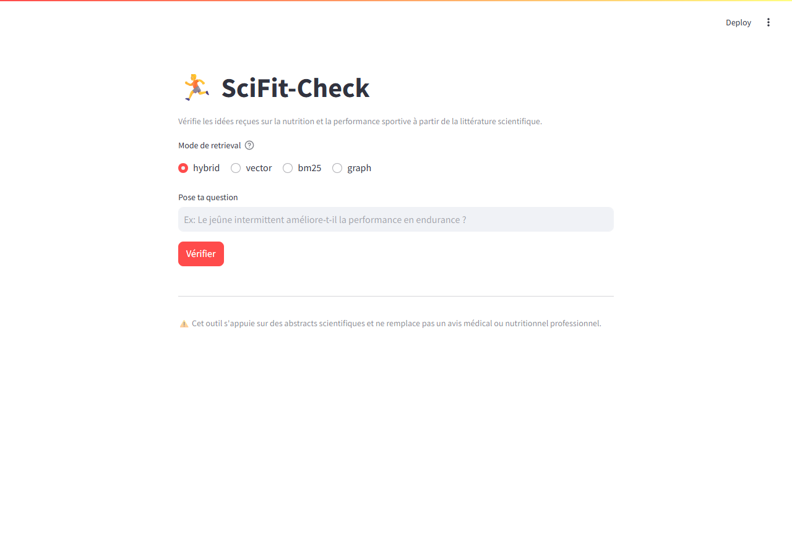
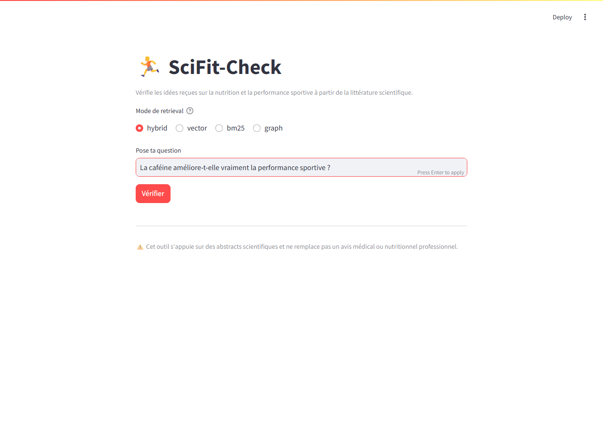

# SciFit-Check — Vérificateur scientifique nutrition & sport

Un système RAG hybride (vecteur + BM25 + GraphRAG léger) qui répond à des
questions sur la nutrition sportive et la performance athlétique en
s'appuyant **uniquement sur la littérature scientifique** (abstracts
PubMed/PMC via Europe PMC, et OpenAlex), avec citations vérifiables et un
niveau de preuve explicite.



## Le problème

Le web regorge d'idées reçues sur le sport et la nutrition — "le cardio à
jeun brûle plus de gras", "il faut des protéines dans les 30 minutes
post-effort", "la caféine améliore forcément la performance"... Ces
affirmations circulent sans qu'on sache si elles s'appuient sur une
méta-analyse solide, un seul essai randomisé, ou rien du tout. Chercher
soi-même dans PubMed demande du temps et des compétences de lecture
critique (quel niveau de preuve ? l'étude contredit-elle d'autres travaux ?).

**SciFit-Check** interroge un corpus d'abstracts scientifiques indexé
localement, retrouve les passages pertinents (recherche hybride
vecteur+lexical, plus un graphe de relations extrait par LLM), puis génère
une réponse qui **cite ses sources** et **indique un niveau de preuve
global** (faible/moyen/élevé selon le nombre et le type d'études
concordantes — méta-analyse > essai randomisé > observationnelle), plutôt
que d'affirmer sans justification comme le ferait un LLM interrogé à nu.

## Grille d'évaluation — où trouver quoi

Ce projet suit une grille d'évaluation par les pairs. Pour aller vite :

| Critère | Où le vérifier |
|---|---|
| Description du problème | Section ci-dessus |
| Flux retrieval + LLM | [Architecture](#architecture) et [Comment ça marche](#comment-ça-marche--exemple) |
| Évaluation du retrieval (plusieurs approches comparées) | [Évaluation](#évaluation) + [docs/evaluation.md](docs/evaluation.md) |
| Évaluation du LLM (plusieurs approches comparées) | [Évaluation](#évaluation) + [docs/evaluation.md](docs/evaluation.md) |
| Interface | Streamlit — [Comment ça marche](#comment-ça-marche--exemple), capture ci-dessus |
| Pipeline d'ingestion | [Ingestion](#ingestion) |
| Monitoring (feedback + dashboard 5+ charts) | [Monitoring](#monitoring) + [docs/monitoring.md](docs/monitoring.md) |
| Containerisation | `docker-compose.yml` — tout le stack (Postgres, Qdrant, Grafana, app) est containerisé |
| Reproductibilité | [Installation](#installation) + [docs/setup.md](docs/setup.md) (env vars, versions épinglées) |
| Bonnes pratiques (hybrid search, etc.) | [Bonnes pratiques](#bonnes-pratiques--auto-évaluation) |

## Architecture

```
                         ┌─────────────────────┐
                         │ Europe PMC / OpenAlex│   APIs publiques,
                         └──────────┬───────────┘   sans clé requise
                                    │ ingestion incrémentale (scripts Python)
                                    ▼
                         ┌─────────────────────┐
                         │   Postgres (raw)     │  papers / chunks / graph_edges / feedback
                         └──────────┬───────────┘
                                    │ chunking par section (IMRaD heuristique)
                    ┌───────────────┼───────────────┐
                    ▼                               ▼
          ┌──────────────────┐            ┌──────────────────────┐
          │  Qdrant (vecteur)│            │  Extraction entités/  │
          │  + BM25 (rank_bm25)│          │  relations (Groq LLM) │
          └─────────┬────────┘            └──────────┬───────────┘
                     │                                ▼
                     │                     ┌──────────────────────┐
                     │                     │  Graphe (NetworkX +   │
                     │                     │  persistance Postgres)│
                     │                     └──────────┬───────────┘
                     └───────────────┬─────────────────┘
                                      ▼
                          ┌────────────────────┐
                          │  Retrieval hybride  │  RRF (Reciprocal Rank Fusion)
                          │  vecteur+BM25, ou    │  vecteur/BM25/hybrid/graph
                          │  traversée du graphe │  selon le mode choisi
                          └──────────┬───────────┘
                                      ▼
                          ┌────────────────────┐
                          │  LLM (Groq Llama)   │  génère la réponse
                          │  + citations +      │  + citations + niveau
                          │  niveau de preuve    │  de preuve, à partir
                          └──────────┬───────────┘  UNIQUEMENT des extraits
                                      ▼
                          ┌────────────────────┐
                          │  Streamlit UI       │
                          │  + feedback 👍👎     │
                          └──────────┬───────────┘
                                      ▼
                          ┌────────────────────┐
                          │  Grafana (monitoring)│
                          └────────────────────┘
```

## Stack technique

| Composant | Choix | Pourquoi (et comment l'utiliser si tu ne le connais pas) |
|---|---|---|
| Ingestion | Scripts Python + [OpenAlex](https://openalex.org) / [Europe PMC](https://europepmc.org) | APIs REST publiques gratuites, aucune clé requise. `python src/ingestion/*.py` — voir [Ingestion](#ingestion). |
| Stockage brut | Postgres (Docker) | Base relationnelle classique, gratuite, self-hosted. |
| Embeddings | [`bge-small-en-v1.5`](https://huggingface.co/BAAI/bge-small-en-v1.5) via `sentence-transformers` | Modèle d'embeddings **local** (tourne sur CPU, pas d'appel API) : convertit un texte en vecteur numérique pour la recherche sémantique. Chargé automatiquement au premier usage (~130 Mo, mis en cache). |
| Vector store | [Qdrant](https://qdrant.tech) (Docker) | Base spécialisée dans la recherche par similarité vectorielle (« quels chunks ont un vecteur proche de celui de ma question ? »). API REST simple, UI de debug sur `:6333/dashboard`. |
| Lexical search | [`rank_bm25`](https://github.com/dorianbrown/rank_bm25) | Algorithme BM25 (comme un moteur de recherche classique par mots-clés) — complète le vecteur sur les termes techniques exacts (noms de molécules, dosages) que les embeddings généralisent parfois trop. |
| Fusion hybride | RRF (Reciprocal Rank Fusion) | Combine deux classements (vecteur + BM25) sans avoir à calibrer un poids entre les deux — implémentation dans [`src/retrieval/hybrid.py`](src/retrieval/hybrid.py). |
| Graphe de connaissances | [NetworkX](https://networkx.org) + persistance Postgres | Un LLM extrait des triplets (sujet, relation, objet — ex: `"caffeine" → improves → "endurance performance"`) depuis chaque abstract ; NetworkX permet de traverser ces relations à la requête. Volontairement léger (pas de Neo4j) pour un projet solo. |
| Extraction d'entités + génération | [Groq](https://groq.com) (Llama 3.3 / gpt-oss, via API) | Inférence LLM très rapide et quasi-gratuite en free tier (200k tokens/jour). Nécessite une clé gratuite sur console.groq.com. |
| Interface | [Streamlit](https://streamlit.io) | Framework Python pour UI web sans JS — `streamlit run app.py` suffit. |
| Monitoring | [Grafana](https://grafana.com) + Postgres | Dashboards branchés directement sur la table `feedback` en SQL, provisionnés automatiquement (voir [Monitoring](#monitoring)). |
| Containerisation | `docker compose` | Un seul fichier pour tout lancer (Postgres, Qdrant, Grafana, app). |

## Installation

Résumé rapide — **détails complets, variables d'environnement et
dépannage dans [docs/setup.md](docs/setup.md)** :

```bash
git clone <url-de-ce-repo>
cd sci-fitness-rag
cp .env.example .env      # renseigner GROQ_API_KEY (gratuite sur console.groq.com)
docker compose up -d      # Postgres, Qdrant, Grafana, app

docker compose exec app python src/ingestion/europepmc.py
docker compose exec app python src/retrieval/build_index.py
docker compose exec app python src/graphrag/extract_entities.py
```

App sur **http://localhost:8502**, Grafana sur **http://localhost:3001**
(`admin`/`admin`).

## Comment ça marche — exemple

1. Choisir un mode de retrieval (`hybrid` par défaut) et poser une
   question :

   

2. Le retriever hybride cherche dans les 1376 chunks indexés. Exemple réel
   (mode `hybrid`, question *"does fasted cardio increase fat oxidation"*) :

   ```
   score   chunk_id                        extrait
   0.0320  W1939241225::result::2          "Peak fat oxidation was 2.3-fold higher in the
                                            LC group (1.54±0.18 vs 0..."
   0.0310  W2562509757::background::0      "Key points: Three weeks of intensified
                                            training and mild energy deficit in elite..."
   0.0305  W2093220749::result::2          "These results suggest that the caffeine
                                            ingestion enhanced endurance performance..."
   ```

3. Ces extraits (avec type d'étude et année) sont injectés dans le prompt
   de génération ([`src/llm/answer.py`](src/llm/answer.py)), qui force le
   LLM à citer `[source: n]` pour chaque affirmation et à conclure par une
   ligne `Niveau de preuve global: <faible|moyen|élevé>`.
4. La réponse s'affiche avec un expander listant les sources utilisées, et
   deux boutons 👍/👎 pour donner un feedback (voir [Monitoring](#monitoring)).

## Ingestion

Deux sources, écrivant dans la même table `papers` (combinables) :

| Script | Source | Points forts | À savoir |
|---|---|---|---|
| `src/ingestion/openalex.py` (recommandé) | [OpenAlex](https://openalex.org) | Toutes disciplines, rate limit généreux, aucune clé | Abstract reconstruit depuis un inverted index — géré automatiquement |
| `src/ingestion/europepmc.py` | [Europe PMC](https://europepmc.org) | Focus biomédical strict, `pubType` précis pour classifier le niveau de preuve | Couverture plus étroite hors biomédical |

C'est une ingestion **semi-automatisée** : des scripts Python déclenchés
manuellement (`docker compose exec app python src/ingestion/*.py`), idempotents
(`ON CONFLICT ... DO UPDATE`, sûr à relancer). Ils rapportent explicitement
nouveaux / mis à jour / ignorés à chaque exécution — pas juste un nombre de
résultats "traités" qui prêterait à confusion.

*Extension possible : brancher ces scripts sur un scheduler (cron, Prefect,
Airflow) pour une ingestion continue plutôt que déclenchée à la main —
non fait ici, volume et fréquence de publication ne le justifiaient pas
pour un projet solo.*

## Évaluation

Deux évaluations automatisées et rejouables en une commande, détaillées
dans **[docs/evaluation.md](docs/evaluation.md)**.

**Retrieval** — 4 modes comparés (Recall@8 / MRR) sur 8 questions annotées :

| Mode | Recall@8 | MRR |
|---|:---:|:---:|
| vector | 1.00 | 0.938 |
| bm25 | 0.875 | 0.625 |
| **hybrid** *(défaut app)* | **1.00** | **0.917** |
| graph | 1.00 | 1.00* |

*\*Le mode `graph` utilise une métrique de hit non comparable rang-à-rang
aux trois autres — voir la discussion complète dans
[docs/evaluation.md](docs/evaluation.md#pourquoi-hybrid-est-le-mode-par-défaut-de-lapp-malgré-ces-chiffres).*

**Génération LLM** — 2 stratégies de prompt comparées via un LLM-judge
(score de fidélité 0-10) : `zero_shot` vs `structured_evidence`. Résultats
**en attente de ré-exécution** (quota Groq gratuit journalier épuisé
pendant la préparation de cette doc) — méthodologie, script fonctionnel et
commande de reproduction dans
[docs/evaluation.md](docs/evaluation.md#2-évaluation-de-la-génération-llm-as-judge).

## Monitoring

Feedback 👍/👎 collecté à chaque réponse (table Postgres `feedback` :
question, réponse, rating, mode de retrieval, latence) **et** dashboard
Grafana provisionné automatiquement avec **6 panels** — détails et capture
dans **[docs/monitoring.md](docs/monitoring.md)**.


## Bonnes pratiques — auto-évaluation

- ✅ **Recherche hybride** (vecteur + BM25 avec RRF), évaluée séparément
  des deux méthodes seules — voir [Évaluation](#évaluation).
- ❌ **Re-ranking** de documents — non implémenté. Piste : un cross-encoder
  léger (ex: `ms-marco-MiniLM`) sur le top-20 hybride avant les 6 chunks
  envoyés au LLM.
- ❌ **Réécriture de requête** — non implémentée. Piste : un appel LLM léger
  pour traduire/reformuler la question française en requête anglaise
  terminologique avant le retrieval (le retrieval hybride souffre
  actuellement du mismatch langue FR question / EN corpus, visible dans le
  score BM25 plus faible — voir [docs/evaluation.md](docs/evaluation.md)).
- ❌ **Déploiement cloud** — non fait, tourne en local via `docker compose`.

## Limitations connues

- Le corpus couvre uniquement les abstracts (pas le texte intégral).
- **82% des papiers sont classés `study_type: unknown`** (visible sur le
  dashboard Grafana) — la classification par `pubType` fonctionne bien pour
  Europe PMC mais OpenAlex ne fournit pas cette métadonnée ; voir
  [docs/monitoring.md](docs/monitoring.md) pour le détail.
- L'extraction d'entités par LLM peut introduire du bruit dans le graphe ;
  traité comme une source de retrieval additionnelle, pas une vérité absolue.
- Ne remplace pas un avis médical ou nutritionnel professionnel.

## Structure du projet

```
src/ingestion/     # scripts d'ingestion (openalex.py, europepmc.py) + schema.sql
src/retrieval/     # chunking, index Qdrant+BM25, retrieval hybride RRF
src/graphrag/      # extraction d'entités/relations (Groq) + traversée NetworkX
src/llm/           # génération de réponse (prompt + citations + niveau de preuve)
src/eval/          # évaluation retrieval + LLM-as-judge + questions annotées
streamlit_app/     # interface utilisateur
monitoring/        # provisioning Grafana (dashboard + datasource)
docs/              # documentation détaillée (setup, évaluation, monitoring)
```

## Documentation complémentaire

- [docs/setup.md](docs/setup.md) — installation pas à pas, toutes les
  variables d'environnement, dépannage (collisions de ports, quota Groq).
- [docs/evaluation.md](docs/evaluation.md) — méthodologie et résultats
  complets des deux évaluations.
- [docs/monitoring.md](docs/monitoring.md) — détail des 6 panels Grafana,
  comment le feedback est collecté, comment peupler le dashboard.
