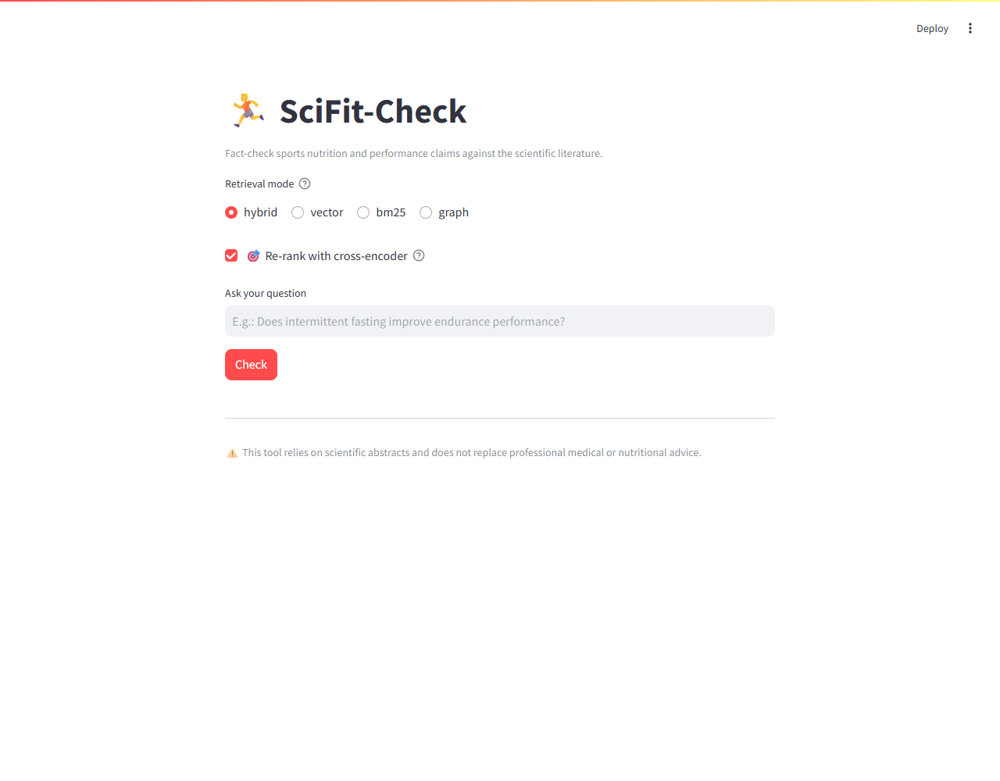
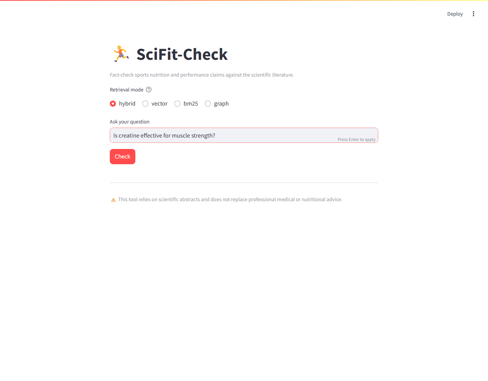
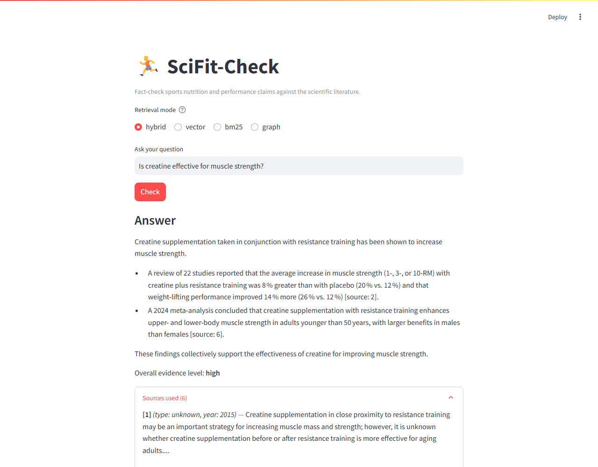

# SciFit-Check — Sports Nutrition Science Checker

An end-to-end hybrid RAG system (vector + BM25 + lightweight GraphRAG) that
answers questions about sports nutrition and athletic performance using
**only peer-reviewed scientific literature** (PubMed/PMC abstracts via
Europe PMC, and OpenAlex), with verifiable citations and an explicit
evidence-strength rating on every answer.



> Built as a course project (DataTalksClub-style LLM/RAG project).
> run, and evaluate the project is below or linked from here.

## The problem

The internet is full of sports-nutrition claims — "fasted cardio burns
more fat", "you need protein within 30 minutes post-workout", "caffeine
always improves performance" — repeated without anyone checking whether
they're backed by a meta-analysis, a single small trial, or nothing at
all. Searching PubMed yourself takes time and the ability to judge
evidence quality (is this a randomized trial or an observational study?
does it contradict other work?).

**SciFit-Check** searches a locally indexed corpus of scientific abstracts
(hybrid vector + lexical search, plus a lightweight knowledge graph
extracted by an LLM), then generates an answer that **cites its sources**
and states an **overall evidence level** (low/medium/high, based on the
number and type of concordant studies — meta-analysis > randomized trial >
observational) — instead of asserting an answer with no grounding, the way
a bare LLM would.

## Quick start 

```bash
git clone <this-repo-url>
cd sci-fitness-rag
cp .env.example .env        # set GROQ_API_KEY (free key at console.groq.com)
docker compose up -d        # Postgres, Qdrant, Grafana, app — fully containerized

# Ingest real data from a public API (no static dataset to download)
docker compose exec app python src/ingestion/europepmc.py
# Optional, broader-coverage complement (any discipline, not just biomedical):
docker compose exec app python src/ingestion/openalex.py

# Build the retrieval indexes (chunking + Qdrant vectors + BM25)
docker compose exec app python src/retrieval/build_index.py

# Build the knowledge graph (LLM entity/relation extraction — uses Groq quota)
docker compose exec app python src/graphrag/extract_entities.py

# Reproduce both evaluations (results already committed under data/eval_results/)
docker compose exec app python src/eval/retrieval_eval.py
docker compose exec app python src/eval/llm_eval.py
```

Then open:
- **App** — http://localhost:8502
- **Grafana monitoring dashboard** — http://localhost:3001 (login `admin` / `admin`)

Full setup details, every environment variable, and troubleshooting
(port collisions, Groq free-tier rate limits) are in
**[docs/setup.md](docs/setup.md)**.

## Architecture

```
                         ┌─────────────────────┐
                         │ Europe PMC / OpenAlex│   Public APIs,
                         └──────────┬───────────┘   no API key required
                                    │ incremental ingestion (Python scripts)
                                    ▼
                         ┌─────────────────────┐
                         │   Postgres (raw)     │  papers / chunks / graph_edges / feedback
                         └──────────┬───────────┘
                                    │ section-aware chunking (IMRaD heuristic)
                    ┌───────────────┼───────────────┐
                    ▼                               ▼
          ┌──────────────────┐            ┌──────────────────────┐
          │ Qdrant (vector)  │            │  Entity/relation       │
          │ + BM25 (rank_bm25)│           │  extraction (Groq LLM) │
          └─────────┬────────┘            └──────────┬───────────┘
                     │                                ▼
                     │                     ┌──────────────────────┐
                     │                     │  Graph (NetworkX +    │
                     │                     │  Postgres persistence)│
                     │                     └──────────┬───────────┘
                     └───────────────┬─────────────────┘
                                      ▼
                          ┌────────────────────┐
                          │  Hybrid retrieval   │  RRF (Reciprocal Rank Fusion)
                          │  vector+BM25, or     │  vector/BM25/hybrid/graph —
                          │  graph traversal     │  selectable mode
                          └──────────┬───────────┘
                                      ▼
                          ┌────────────────────┐
                          │  LLM (Groq Llama)   │  generates the answer,
                          │  answer + citations │  citing sources + an
                          │  + evidence level    │  evidence-level line,
                          └──────────┬───────────┘  grounded ONLY in the
                                      ▼              retrieved excerpts
                          ┌────────────────────┐
                          │  Streamlit UI       │
                          │  + 👍👎 feedback     │
                          └──────────┬───────────┘
                                      ▼
                          ┌────────────────────┐
                          │ Grafana (monitoring)│
                          └────────────────────┘
```

## Tech stack


| Component | Choice | What it is / why |
|---|---|---|
| Ingestion | Python scripts + [OpenAlex](https://openalex.org) / [Europe PMC](https://europepmc.org) | Free public REST APIs, no API key required. `python src/ingestion/*.py` — see [Ingestion](#ingestion). |
| Raw storage | Postgres (Docker) | Standard relational database, free, self-hosted. |
| Embeddings | [`bge-small-en-v1.5`](https://huggingface.co/BAAI/bge-small-en-v1.5) via `sentence-transformers` | A **local** embedding model (runs on CPU, no API call): turns text into a numeric vector for semantic search. Downloaded automatically on first use (~130MB, then cached). |
| Vector store | [Qdrant](https://qdrant.tech) (Docker) | A database specialized in similarity search over vectors ("which chunks have a vector close to my question's?"). Simple REST API, has a debug UI at `:6333/dashboard`. |
| Lexical search | [`rank_bm25`](https://github.com/dorianbrown/rank_bm25) | BM25 (classic keyword-based search algorithm, like what search engines used before embeddings) — complements the vector search on exact technical terms (drug names, dosages) that embeddings sometimes over-generalize. |
| Hybrid fusion | RRF (Reciprocal Rank Fusion) | Combines two rankings (vector + BM25) without having to tune a weight between them — implemented in [`src/retrieval/hybrid.py`](src/retrieval/hybrid.py). |
| Knowledge graph | [NetworkX](https://networkx.org) + Postgres persistence | An LLM extracts triplets (subject, relation, object — e.g. `"caffeine" → improves → "endurance performance"`) from each abstract; NetworkX lets us traverse these relations at query time. Deliberately lightweight (no Neo4j) for a solo project. |
| Entity extraction + generation | [Groq](https://groq.com) (Llama 3.3 / gpt-oss, via API) | Very fast, near-free LLM inference on the free tier (200k tokens/day). Requires a free key from console.groq.com. |
| Interface | [Streamlit](https://streamlit.io) | Python web UI framework, no JS needed — `streamlit run app.py`. |
| Monitoring | [Grafana](https://grafana.com) + Postgres | Dashboards wired directly to the `feedback` table via SQL, auto-provisioned on startup (see [Monitoring](#monitoring)). |
| Containerization | `docker compose` | Single file to launch everything (Postgres, Qdrant, Grafana, app). |

## How it works — worked example

1. Pick a retrieval mode (`hybrid` is the default) and ask a question:

   

2. The hybrid retriever searches across the indexed chunks. Real example
   (mode `hybrid`, question *"does fasted cardio increase fat oxidation"*):

   ```
   score   chunk_id                    excerpt
   0.0320  W1939241225::result::2      "Peak fat oxidation was 2.3-fold higher in the
                                        LC group (1.54±0.18 vs 0..."
   0.0310  W2562509757::background::0  "Key points: Three weeks of intensified
                                        training and mild energy deficit in elite..."
   0.0305  W2093220749::result::2      "These results suggest that the caffeine
                                        ingestion enhanced endurance performance..."
   ```

3. These excerpts (with study type and year) are injected into the answer
   prompt ([`src/llm/answer.py`](src/llm/answer.py)), which forces the LLM
   to cite `[source: n]` for every claim and end with a line
   `Overall evidence level: <low|medium|high>`.
4. The answer is shown with an expander listing the sources used, and two
   buttons 👍/👎 to leave feedback (see [Monitoring](#monitoring)):

   

Interface, prompts, and generated answers are all in English — the app
accepts questions in any language Groq's model understands (French
included), but always answers in English.


## Ingestion

Two sources, writing into the same `papers` table (can be combined):

| Script | Source | Strengths | Caveat |
|---|---|---|---|
| `src/ingestion/openalex.py` (recommended) | [OpenAlex](https://openalex.org) | All disciplines, generous rate limit, no key required | Abstract is reconstructed from an inverted index — handled automatically |
| `src/ingestion/europepmc.py` | [Europe PMC](https://europepmc.org) | Strict biomedical focus, precise `pubType` for evidence-level classification | Narrower coverage outside biomedical topics |

This is a **semi-automated** ingestion pipeline: Python scripts triggered
manually (`docker compose exec app python src/ingestion/*.py`), idempotent
(`ON CONFLICT ... DO UPDATE`, safe to re-run). They report new / updated /
skipped counts explicitly on every run — not just a "processed N results"
number that would be easy to misread as "N new rows added".

*Possible extension: wire these scripts into a scheduler (cron, Prefect,
Airflow) for continuous ingestion rather than manually triggered — not
done here

## Evaluation

Two automated evaluations, each reproducible with a single command, fully
detailed in **[docs/evaluation.md](docs/evaluation.md)**.

**Retrieval** — 4 modes compared (Recall@8 / MRR) on 8 annotated questions:

| Mode | Recall@8 | MRR |
|---|:---:|:---:|
| vector | 1.00 | 0.938 |
| bm25 | 0.875 | 0.625 |
| **hybrid** *(app default)* | **1.00** | **0.917** |
| graph | 1.00 | 1.00* |

*\*The `graph` mode uses a hit-based metric that isn't directly comparable
rank-for-rank to the other three — see the full discussion in
[docs/evaluation.md](docs/evaluation.md#why-hybrid-is-the-apps-default-mode-despite-these-numbers).*

Each of these 4 modes was also re-evaluated **with cross-encoder
re-ranking** on top — see
[Best practices](#known-limitations--self-assessment) below for the
(mixed, mode-dependent) result.

**LLM generation** — 2 prompting strategies compared via an LLM-judge
(faithfulness score 0-10), full 8-question run:

| Strategy | n scored | Avg. faithfulness |
|---|:---:|:---:|
| **`zero_shot`** *(matches the production prompt)* | 7/8 | **9.7 / 10** |
| `structured_evidence` | 7/8 | 9.3 / 10 |

Full methodology, per-question scores, and exact reproduce command in
[docs/evaluation.md](docs/evaluation.md#2-llm-generation-evaluation-llm-as-judge).

## Monitoring

👍/👎 feedback is collected on every answer, **and every single request**
(rated or not) is logged with full instrumentation — latency broken down
by stage (embedding/search/generation), token cost, retrieval score
quality, source diversity, corpus freshness, and error rate. A Grafana
dashboard is auto-provisioned with **17 charts** across usage, cost,
generation quality, and retrieval quality — details and screenshot in
**[docs/monitoring.md](docs/monitoring.md)**.


## Known limitations & self-assessment

- ❌ **Query rewriting** — not implemented. Would add: a light LLM call to
  reformulate the user's question into English retrieval terminology
  before search (the corpus and prompts are English; a question asked in
  another language is more likely to hurt BM25's exact-match scoring than
  the embedding-based modes — see [docs/evaluation.md](docs/evaluation.md)).
- ❌ **Cloud deployment** — not done, runs locally via `docker compose`.


## Project structure

```
src/ingestion/     # ingestion scripts (openalex.py, europepmc.py) + schema.sql
src/retrieval/     # chunking, Qdrant+BM25 index building, hybrid RRF retrieval
src/graphrag/      # entity/relation extraction (Groq) + NetworkX traversal
src/llm/           # answer generation (prompt + citations + evidence level)
src/eval/          # retrieval + LLM-as-judge evaluation, annotated questions
streamlit_app/     # user interface
monitoring/        # Grafana provisioning (dashboard + datasource)
docs/              # detailed docs (setup, evaluation, monitoring)
```

## More documentation

- [docs/setup.md](docs/setup.md) — step-by-step install, every environment
  variable, troubleshooting (port collisions, Groq quota limits).
- [docs/evaluation.md](docs/evaluation.md) — full methodology and results
  for both evaluations.
- [docs/monitoring.md](docs/monitoring.md) — the 6 Grafana panels
  explained, how feedback is collected, how to seed the dashboard.
