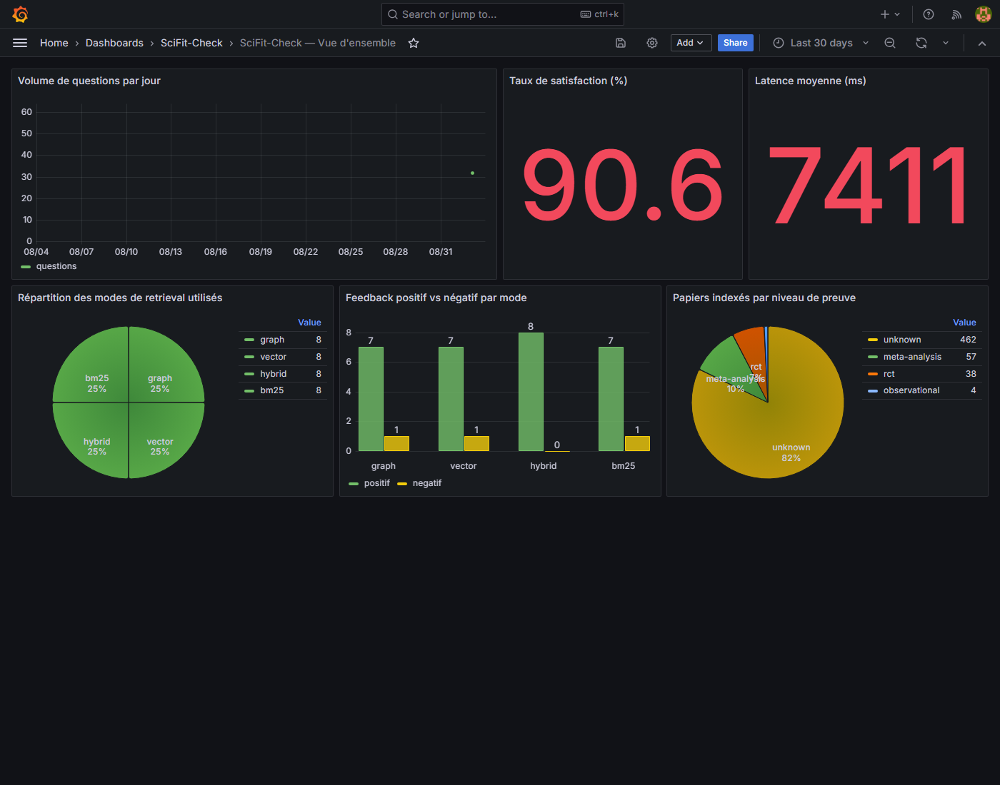

# Monitoring

Back to the [README](../README.md).

## How feedback is collected

Every answer shown in the Streamlit app ([streamlit_app/app.py](../streamlit_app/app.py))
has two buttons, **👍 Utile** ("Useful") / **👎 Pas utile** ("Not useful").
A click inserts a row into the Postgres `feedback` table:

```sql
INSERT INTO feedback (question, answer, rating, retrieval_mode, latency_ms)
VALUES (%s, %s, %s, %s, %s)
```

`rating` (+1/-1), `retrieval_mode` (hybrid/vector/bm25/graph), and
`latency_ms` (measured client-side, from clicking "Vérifier" to the
answer being generated) are recorded every time — not just an aggregate
counter — which makes it possible to break down by mode or over time.

## Grafana dashboard

Auto-provisioned at startup (`monitoring/provisioning/`, no manual Grafana
UI configuration needed) — available as soon as `docker compose up -d`
runs, at http://localhost:3001 (`admin`/`admin`), folder **SciFit-Check**.



6 panels ([source JSON](../monitoring/provisioning/dashboards/scifit_overview.json)):

| Panel | Type | Source | What it shows |
|---|---|---|---|
| Volume de questions par jour (questions/day) | timeseries | `feedback` | Usage over time |
| Taux de satisfaction (%) (satisfaction rate) | stat | `feedback` | % of positive ratings |
| Latence moyenne (ms) (average latency) | stat | `feedback` | End-to-end average response time |
| Répartition des modes de retrieval utilisés (retrieval mode split) | piechart | `feedback` | hybrid vs vector vs bm25 vs graph |
| Feedback positif vs négatif par mode (positive vs negative feedback by mode) | barchart | `feedback` | Perceived quality per retrieval mode |
| Papiers indexés par niveau de preuve (papers by evidence level) | piechart | `papers` | Corpus composition (meta-analysis/rct/observational/unknown) |

The last panel doesn't depend on the `feedback` table — it reflects the
state of the indexed corpus and works right after ingestion, before any
user interaction. It's the one visible in the screenshot above: **462 out
of 561 papers (82%) are classified `unknown`** — a real blind spot worth
noting honestly rather than hiding: `classify_study_type()`
([src/ingestion/europepmc.py](../src/ingestion/europepmc.py)) relies on
`pubTypeList`, available and reliable from Europe PMC but absent from
OpenAlex metadata, which feeds a large share of the corpus. Improvement
path: classify `study_type` heuristically from title/abstract for
OpenAlex-sourced papers, or only use OpenAlex as a targeted complement.

### The other 5 panels (based on `feedback`)

Populated by running the demo seed script
([`src/eval/seed_feedback_demo.py`](../src/eval/seed_feedback_demo.py)):
runs the real pipeline (retrieval + Groq generation) over the 8 annotated
questions × 4 modes, and logs each interaction into `feedback` exactly
like the app would. The rating isn't a randomly simulated human opinion:
it's derived from an automatic check of the expected answer format
(source citation + "evidence level" line present, per the prompt in
`src/llm/answer.py`) — or, correctly, a positive rating when the model
explicitly declines to answer for lack of relevant sources, since that's
the behavior the prompt asks for, not a formatting failure.

```bash
docker compose exec app python src/eval/seed_feedback_demo.py
```

⚠️ Uses ~32 Groq calls, paced 8s apart to stay under Groq's 8,000
tokens/minute limit — see [Groq quota](setup.md#groq-free-tier-quota).

The alternative is normal usage: open the app, ask questions, click 👍/👎.

Current state (32 seeded interactions): **90.6% satisfaction**, ~7.4s
average latency, evenly split across the 4 retrieval modes (8 each, since
the seed script deliberately cycles through all of them) — visible on the
dashboard above.

### Two real bugs found by actually testing this dashboard, not just committing config

1. **Both `piechart` panels showed one merged slice instead of real
   categories.** Without an explicit `reduceOptions.values: true`, Grafana
   (v11) collapses every row of a table query into a single aggregated
   value named "total". Fixed in the panel `options`.
2. **All 5 `feedback`-based panels showed "No data" despite the table
   having real rows.** The dashboard's default time range was "Last 6
   hours", but `date_trunc('day', created_at)` (used by the "Volume de
   questions par jour" panel) buckets every row inserted today down to
   *today at 00:00* — which was already outside a 6-hour window by the
   time the data was queried. Grafana's panel then clips data points
   outside the selected range client-side, even though the underlying SQL
   query itself ignores the time picker and already returned the row.
   Fixed by setting the dashboard's default range to `now-30d` → `now`
   (`monitoring/provisioning/dashboards/scifit_overview.json`, top-level
   `"time"` key) — comfortably wide for a project with this little
   traffic, without needing a custom time picker each time someone opens
   it.

Neither bug was visible from reading the JSON — both only showed up once
real data existed and the dashboard was actually opened in a browser.

## What's missing to go further

- **Alerting**: Grafana supports it natively (the "Alert rules" tab is
  already visible in the provisioned UI) — not configured here, but a
  threshold on satisfaction rate or latency would be the logical next
  step.
- **Structured application logs**: currently only explicit feedback is
  tracked; errors (e.g. empty retrieval, a failed Groq call) only surface
  as `st.warning()` in the UI, not in a queryable table.
